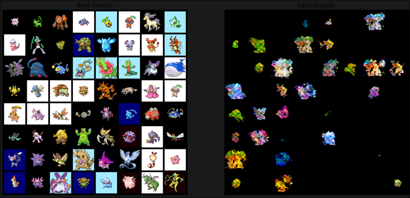

# PokéGAN

This repo contains the AI Lab project, which consisted in creating a DC-GAN model to try and generate images of new Pokémons starting from a small database of images.

Due to the nature of Jupyter notebooks, as well as file size restrictions on Github, it itsn't possible to look at the notebook directly from this repo;
to do so, one could download the source .ipynb then open it with Google colab or an IDE that supports the extension.

## Quick rundown

As said above, the project consisted in creating a generative and adversarial network (GAN). A GAN essentially consists in two neural networks, one that generates images and another that tries to predict whether they're generated or not. Both are trained to outdo the other: the generator wants to fool the Discriminator into thinking its generated images are real, and the discriminator trains to be able to tell whether an image comes from the generator or not.
The GAN model was the first highly successful model in generating deep fake images, all the while remaining fairly simple in principle and being very cost-efficient relative to other models.

The notebook is structured as follows:

1. We first define parameters
2. Load the data from a personal Google drive folder (it's a fairly small private dataset of ~500 64 by 64 images)
3. Create both the Generator and the Discriminator, the two adversarial neural networks in a GAN
4. Initialise the networks' weights and define hyperparameters
5. Train and refine both networks

While ultimately we weren't able to obtain good images, given the size of dataset and the very limited computational power, the results were deemed satisfactory.

